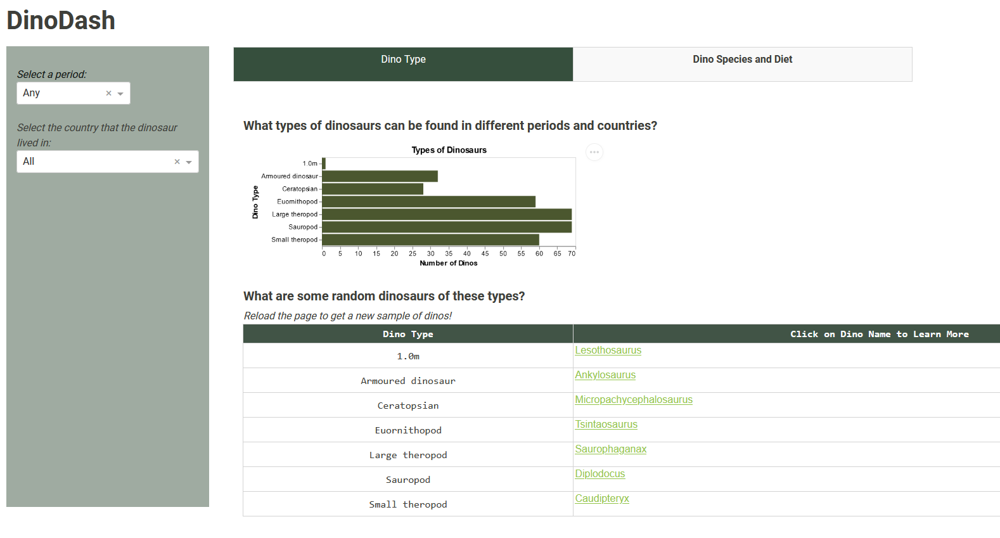
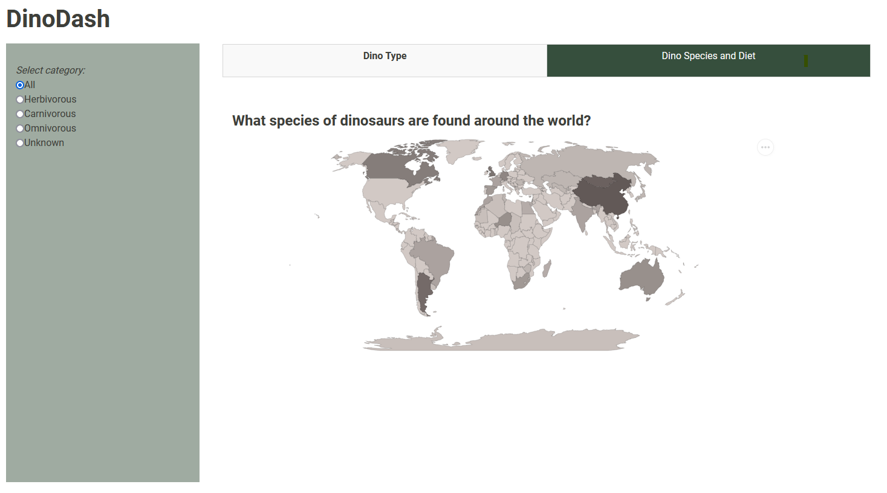

# DinoDash

### Usage

The first tab of the dashboard shows the distribution of types of dinosaurs. By default the whole dataset is used for this histogram. However, the sidebar includes two dropdowns to narrow down the sample by the period and the location that the dinosaur lived in. If the user chooses a period, the dropdown for the locations will be updated to only show regions where dinosaurs existed during that period. The user's choices in the sidebar will change the histogram but also the data table below the histogram that randomly picks a dinosaur of each type. The user can click on the name of the dinosaur to be redirected to the National History Museum's webpage on that dinosaur. The second tab of the dashboard shows a heat map. It is colored according to the number of species that were lived in that country. The sidebar includes a radio widget to allow the user to pick the diet of the dinosaur. They may pick one or all types of diet and the map will be updated accordingly.

### Reference
The primary data, ["jurassic-park"](https://github.com/kjanjua26/jurassic-park/tree/main/data) is from a project repository under the MIT License.

The dataset for the ISO codes is [Countries ISO Codes](https://www.kaggle.com/datasets/juanumusic/countries-iso-codes) licensed under CC0:Public Domain.

The information for the dataset has been scraped from [National History Museums's website](https://www.nhm.ac.uk/)

The software and associated documentation files are licensed under the MIT License. You may find a copy of the license at [LICENSE](https://github.com/ritisha2000/dino-dash/blob/main/LICENSE).
